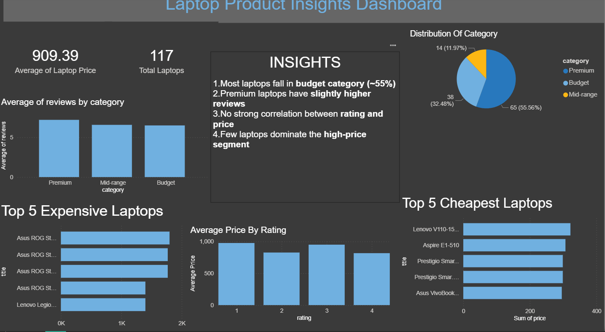

# 💻 Laptop Pricing & Review Insights Dashboard

## 📌 Project Overview

This project is an end-to-end data analysis pipeline built to extract insights from laptop listings. It involves web scraping, data cleaning, SQL-based analysis, and dashboard visualization to understand pricing trends, ratings, and customer engagement.

---

## 🎯 Objective

To analyze laptop pricing, ratings, and reviews in order to uncover patterns in consumer behavior and product positioning.

---

## ⚙️ Tools & Technologies

* Python (requests, BeautifulSoup, pandas)
* SQL
* Power BI

---

## 🔄 Workflow

1. **Data Collection**
   Scraped laptop data from an e-commerce test website using Python and BeautifulSoup.

2. **Data Cleaning**
   Processed and cleaned raw data using pandas (handled missing values, formatted columns).

3. **Data Analysis**
   Performed SQL queries to analyze:

   * Price distribution
   * Rating vs price
   * Reviews vs category
   * Top and bottom products

4. **Data Visualization**
   Built an interactive dashboard using Power BI to present insights clearly.

---

## 📊 Key Insights

* Most laptops fall under the **budget category (~55%)**
* **Premium laptops** receive slightly higher customer reviews
* There is **no strong correlation between rating and price**
* A small number of laptops dominate the **high-price segment**
* Higher price does not always guarantee higher customer engagement

---

## 📁 Project Structure

```
laptop-price-analysis/
│
├── data/
│   └── laptops.csv
│
├── scripts/
│   └── scraper.py
│
├── sql/
│   └── analysis.sql
│
├── dashboard/
│   └── laptop_dashboard.pbix
│
└── README.md
```

---

## 📸 Dashboard Preview



---

## 🚀 What I Learned

* Web scraping using BeautifulSoup
* Data cleaning and preprocessing using pandas
* Writing analytical SQL queries
* Building business-focused dashboards in Power BI
* Converting raw data into actionable insights

---

## 🔮 Future Improvements

* Automate scraping to collect real-time data
* Expand dataset using real-world e-commerce platforms
* Add advanced analytics (correlation, trends over time)
* Improve dashboard interactivity

---

## 📬 Contact

If you have feedback or suggestions, feel free to connect!
